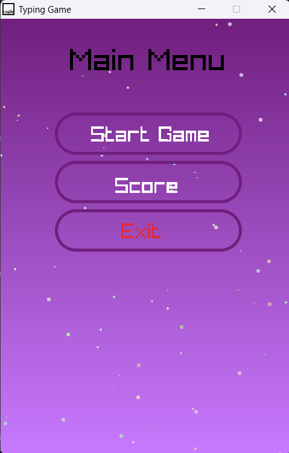
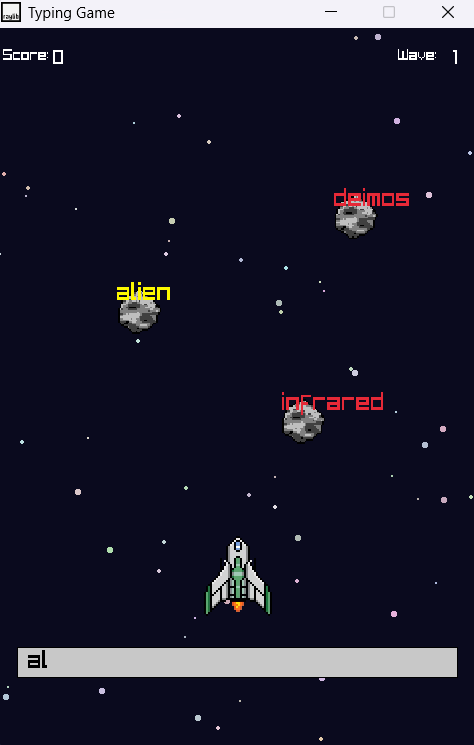
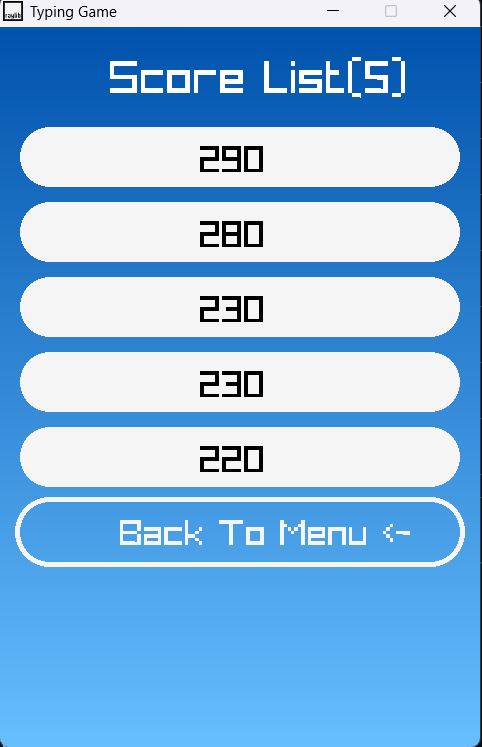

# 🚀 Astrotype Game

A retro-style, wave-based typing shooter game made in **C++** using the [raylib](https://www.raylib.com/) library. Destroy incoming asteroids by typing the words they carry, test your typing speed, and survive through waves of increasing difficulty!

---

## 🎮 Gameplay

- Words fall on asteroids toward your spaceship.
- Type the correct word and press Enter to fire a laser beam and destroy the asteroid.
- Waves get harder with faster and more frequent asteroids.
- Survive as long as you can without a collision.
- Your score is saved and displayed in the scoreboard.

---

## ✨ Features
 
✅ Dynamic wave system with difficulty scaling  
✅ Trie-based word search for fast matching  
✅ Skew heap to manage top 5 scores  
✅ Background starfield animation  
✅ Collision detection with visual explosion effects  
✅ Shooting animations using beam particles  
✅ Background music & explosion sound  
✅ Usage of File I/O For Persisten Storage
✅ Menu, Scoreboard, and Game Over screens

---
## 🖼️ Screenshots

| Menu                        | Gameplay                         | Scoreboard                      |
|----------------------------|----------------------------------|---------------------------------|
|    |  |     |

## 📂 Folder Structure

Z-Type-Game/
│
├── main.cpp # Main game loop
├── tries.h # Trie data structure (for word matching)
├── skew.h # Skew heap (for min scores)
├── words.h # Word list (100+ words)
├── scores.txt # Auto-generated score log

## Building the Game

Compile Using 
g++ main.cpp -o astrotype.exe -lraylib -lopengl32 -lgdi32 -lwinmm

##👨‍💻 Author

Developed by Naveen O.T
Feel free to ⭐ star the repo and give feedback!

##🙏 Acknowledgments
raylib
Fonts: PressStart2P
NCS

